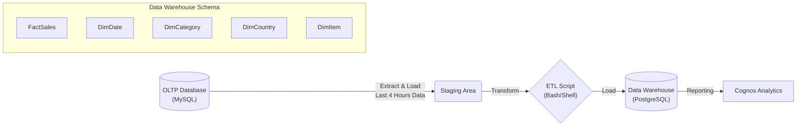

# IBM Data Warehousing Capstone Project

## 📌 Project Overview
This repository contains the capstone project for the **IBM Data Warehousing** course. The project involves building a complete data pipeline solution—from designing an OLTP database for an e-commerce platform ("SoftCart") to implementing a Data Warehouse with a Star Schema, automating ETL processes using Shell scripts, and generating business intelligence reports using Cognos Analytics.

The goal is to demonstrate end-to-end data engineering skills, including database design, data modeling, ETL automation, and data visualization.

## 🏗️ Architecture Flow

The data flows from a transactional system (OLTP) to a staging area, undergoes transformation, and is finally loaded into a Data Warehouse for analytical reporting.

## 📂 Repository Structure

* **`w1-mysql-oltp/`**: Contains scripts for setting up the OLTP database.
* `sales_data.sql`: SQL dump for the initial sales transactional data.
* `datadump.sh`: Script to export data from the production DB.

* **`w2-data-warehousing/`**: Focuses on schema design and data modeling.
* `create_star_schema.sql`: SQL script to define the Star Schema (Dimension and Fact tables).
* `create_script.sql`: Table creation scripts.
* `queries_for_data_analytics.sql`: Analytical queries using advanced SQL (Grouping Sets, Rollup, Cube, MQT).

* **`w3-cognos-analytics/`**: Contains assets related to BI reporting.
* `data/`: Source CSVs used for Cognos.
* `screenshots/`: Visualizations created in IBM Cognos Analytics (Line charts, Pie charts, Bar charts).

* **`w4-etl-using-shell-scripts/`**: Automation of the data pipeline.
* `ETL.sh`: The core Bash script that automates extraction from MySQL, transformation, and loading into PostgreSQL.
* `setuppostgresqldb.sh`: Script to initialize the Data Warehouse environment.

## 🛠️ Technical Details

### 1. OLTP Database Design (MySQL)

The transactional system is hosted on **MySQL**. It stores real-time sales data including `product_id`, `customer_id`, `price`, `quantity`, and `timestamp`.

### 2. Data Warehouse Schema (PostgreSQL/DB2)

The warehouse utilizes a **Star Schema** optimized for analytical queries. The schema consists of:

* **Fact Table:** `softcartfactsales` (Order details, metrics like price).
* **Dimension Tables:**
* `softcartdimdate` (Date hierarchy: Year, Quarter, Month, Day).
* `softcartdimcategory` (Product categories).
* `softcartdimcountry` (Geographical data).
* `softcartdimitem` (Item details).

### 3. ETL Process

The ETL pipeline is automated using a Shell script (`ETL.sh`) that performs the following steps:

1. **Extract:** Queries the MySQL `sales` database for transaction records created in the last 4 hours.
2. **Transform:** Cleans and formats the data (e.g., converting tab-separated values to CSV format).
3. **Load:** Bulk loads the data into the PostgreSQL warehouse (`sales_new` database).
4. **Populate:** Inserts distinct date records into `DimDate` and aggregated sales data into `FactSales`.
5. **Export:** Dumps the finalized Fact and Dimension tables to CSV for reporting tools.

### 4. Data Analytics & Reporting

**IBM Cognos Analytics** is used to connect to the Data Warehouse and generate insights, such as:

* Sales trends over time.
* Revenue by country and category.
* Quarterly sales performance.

## 🚀 How to Run

1. **Setup Databases:**
* Import `w1-mysql-oltp/sales_data.sql` into your MySQL instance.
* Run `w4-etl-using-shell-scripts/setuppostgresqldb.sh` to set up the PostgreSQL warehouse.

2. **Configure Credentials:**
* Edit `w4-etl-using-shell-scripts/ETL.sh` and update the `MYSQL_PASSWORD` and `PG_PASSWORD` variables with your local database credentials.

3. **Run ETL:**
* Execute the script: `./w4-etl-using-shell-scripts/ETL.sh`

4. **Verify:**
* Check the `FactSales` and `DimDate` tables in PostgreSQL to ensure new data has been populated.

## 👤 Author

[**Bagas Wahyu Herdiansyah**](https://www.linkedin.com/in/bagas-wahyu-herdiansyah/)

## 📄 License

This project is licensed under the MIT License - see the [LICENSE](LICENSE) file for details.

---

*This project is part of the IBM Data Engineering Professional Certificate.*

